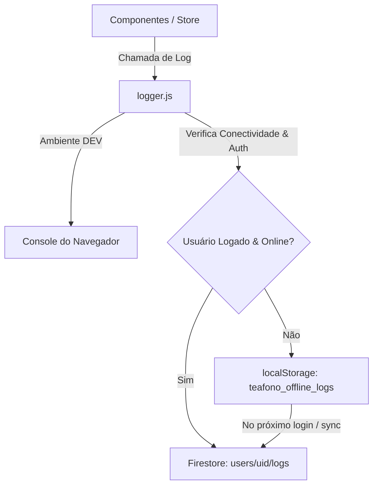

# Documentação de Segurança, Sanitização e Logs Detalhados

Este documento descreve as implementações de segurança e logs detalhados adicionadas ao projeto TeaFono para proteção de dados do paciente e auditoria clínica.

---

## 1. Arquitetura de Logs (Firebase Logging)

O sistema de logs detalhados permite rastrear eventos de auditoria clínica, erros e acessos diretamente na nuvem (Firestore) ou localmente em cache offline.

### Fluxo de Dados de Log


### Detalhes de Implementação
- **Níveis de Log**:
  - `INFO`: Ações de sucesso como login, cadastro de paciente infantil, atualizações e salvamento de avaliações.
  - `WARN`: Problemas não-fatais, como falha de sincronização de rede ou validação falha.
  - `ERROR`: Falhas graves do sistema, como erros de banco de dados ou exceções não tratadas.
- **Anonimização de PII (LGPD)**:
  O módulo de log limpa automaticamente informações sensíveis dos pacientes (`name`, `phone`, `birthDate`, `speechComplaint`, `diagnosis`, `responsible`) antes de enviá-los ao banco de dados, substituindo-as pela marcação `[REDACTED]`. Isso evita a exposição de dados identificáveis em relatórios de log.
- **Fila Offline**:
  Se o terapeuta estiver desconectado, os logs são armazenados em fila no `localStorage` sob a chave `teafono_offline_logs` (limitado a 100 registros). No momento da autenticação ou reconectividade, a função `flushOfflineLogs` faz o upload de todos os logs offline acumulados em lote.

---

## 2. Validação e Segurança da Anamnese

Ao reativar o módulo de anamnese fonoaudiológica, implementamos regras estritas de segurança da informação e sanitização de dados no arquivo [securityUtils.js](file:///c:/antigravity/PROJETO%20FONO/teafono/src/utils/securityUtils.js).

### Sanitização Anti-XSS (Cross-Site Scripting)
Qualquer campo de texto livre preenchido no formulário de Anamnese (e de qualquer outro exame) passa por uma limpeza recursiva no cliente antes do salvamento em banco. O utilitário:
- Remove tags `<script>` e seus conteúdos.
- Remove tags HTML em geral (evitando estilizações não controladas ou injeção de layouts maliciosos).
- Remove handlers de eventos como `onload`, `onerror`, `onclick`.
- Remove o pseudo-protocolo `javascript:`.

### Validação de Dados
- **Número de telefone**: Valida que o telefone de contato do responsável tenha um número plausível (entre 8 e 15 dígitos).
- **Data de nascimento**: Bloqueia datas futuras incoerentes no cadastro ou edição.

---

## 3. Como Manter e Expandir o Sistema de Logs

1. **Adicionar novos logs no código**:
   Importe as funções auxiliares em qualquer componente ou store:
   ```javascript
   import { logInfo, logWarn, logError } from '../utils/logger';
   ```
2. **Uso de metadados**:
   Sempre envie metadados úteis para o diagnóstico no segundo parâmetro:
   ```javascript
   logInfo('Mudança de aba no dashboard', { tabName: 'historico' });
   ```
3. **Segurança de chaves**:
   Se adicionar novos campos sensíveis de pacientes na ficha cadastral, inclua a chave na lista `sensitiveKeys` do arquivo [logger.js](file:///c:/antigravity/PROJETO%20FONO/teafono/src/utils/logger.js#L14) para garantir que eles sejam sempre redigidos dos logs.
